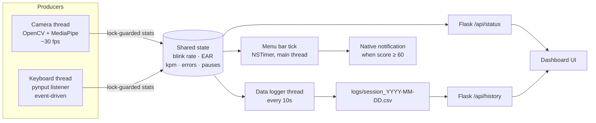

# FocusGuard

A lightweight macOS menu bar app that monitors fatigue and stress in real-time using your camera and keyboard behaviour.

 

---

## What it does

FocusGuard sits in your menu bar and quietly watches two signals:

| Signal | What it measures |
|---|---|
| **Camera** | Blink rate and eye openness (EAR) via MediaPipe face mesh |
| **Keyboard** | Typing speed, error rate (backspaces), and pause length |

It combines these into a **Fatigue** score and a **Stress** score, shows them in the menu bar, and sends a native macOS notification when it's time to take a break.

---

## Features

- **Menu bar icon** — `🟢/🟡/🔴 XX%` combined score, updates every 10 seconds
- **Quick dropdown** — camera status, all three scores, and any active signals at a glance
- **Full dashboard** — click *Open Dashboard* for a live web UI with raw parameter gauges
- **Native notifications** — macOS system notification when score ≥ 60 (10-min cooldown)
- No cloud, no accounts — everything runs locally

---

## How scores are calculated

### Fatigue (camera + keyboard)
| Condition | Points |
|---|---|
| Blink rate < 12/min | up to +40 |
| Blink rate > 20/min (irritation) | up to +20 |
| Eye openness (EAR) < 0.22 | up to +50 |
| Avg typing pause > 8s | up to +30 |

### Stress (keyboard)
| Condition | Points |
|---|---|
| Error rate (backspaces) > 15% | up to +60 |
| Typing speed > 400 kpm (frantic) | up to +30 |

**Combined** = Fatigue × 0.6 + Stress × 0.4 — break recommended at ≥ 60.

All thresholds live in [`config.json`](config.json) — edit and restart to tune. Missing keys fall back to built-in defaults.

---

## How It Works

FocusGuard is a multi-threaded producer-consumer system: three independent producer threads acquire data on their own clocks, and consumers read synchronized snapshots of shared state.



- **Camera and keyboard producers** each own a `threading.Lock` guarding their rolling windows and derived stats. Producers hold the lock only for short append/recalculate sections; `get_stats()` returns a point-in-time snapshot under the same lock, so consumers never see half-updated values.
- **The data logger** samples *both* monitors in the same tick before scoring, so every CSV row is a timestamp-aligned snapshot across modalities — the standard pattern for multi-sensor fusion logging.
- **Consumers** (menu bar tick, Flask endpoints, logger) are all read-only against monitor state; scoring in `detector.py` is pure functions of the snapshots.

---

## Requirements

- macOS 12 or later
- Python 3.9+
- Camera and Accessibility permissions granted to Terminal

---

## Setup

```bash
git clone https://github.com/hmbirmingham/focus-guard.git
cd focus-guard
pip3 install -r requirements.txt
```

### Permissions (first run only)

1. **Camera** → System Settings › Privacy & Security › Camera → enable Terminal
2. **Accessibility** → System Settings › Privacy & Security › Accessibility → add Terminal

---

## Run

```bash
python3 app.py
```

The menu bar icon appears immediately. Click *Open Dashboard* for the full UI at `http://127.0.0.1:5001`.

Stop with `Ctrl+C` in the terminal.

---

## Project structure

```
focus-guard/
├── app.py              # Menu bar app (PyObjC) + Flask dashboard server
├── camera_monitor.py   # MediaPipe face mesh — blink rate & EAR
├── keyboard_monitor.py # pynput — speed, error rate, pauses
├── detector.py         # Scoring logic + config loading
├── data_logger.py      # Synchronized CSV logging thread
├── notifier.py         # macOS notifications via osascript
├── config.json         # Tunable thresholds (optional — defaults built in)
├── main.py             # Legacy terminal-only runner
├── logs/               # session_YYYY-MM-DD.csv (created at runtime)
└── ui/
    └── index.html      # Apple-style dashboard (auto-refreshes every 5s)
```

---

## Data logging

Every 10 seconds a synchronized row is appended to `logs/session_YYYY-MM-DD.csv`:

```
timestamp, blink_rate, avg_ear, face_detected, keys_per_minute,
error_rate, avg_pause_secs, fatigue_score, stress_score, combined_score
```

One file per day, appended across restarts. The dashboard's trend chart reads the last hour via `/api/history`.

---

## Roadmap

- [x] Historical charts (fatigue trend over the session)
- [x] Configurable thresholds (`config.json`)
- [x] Synchronized multi-modal data logging (CSV)
- [ ] Package as a `.app` bundle (no Terminal needed)
- [ ] Pomodoro-style break timer
- [ ] Dock-less launch on login
- [ ] Daily summary report from logged data
